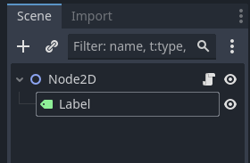
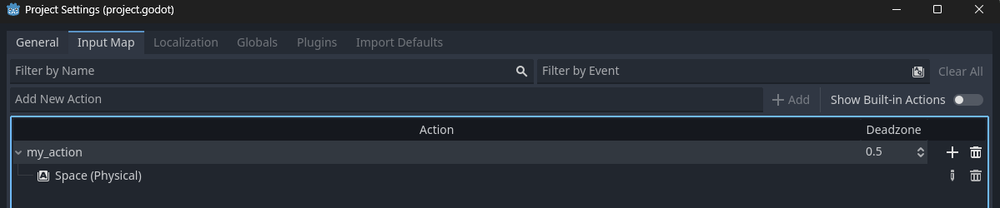
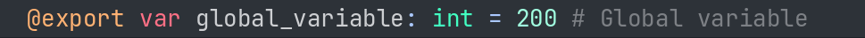
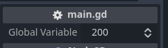
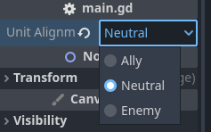
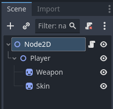
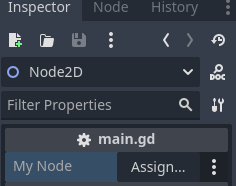
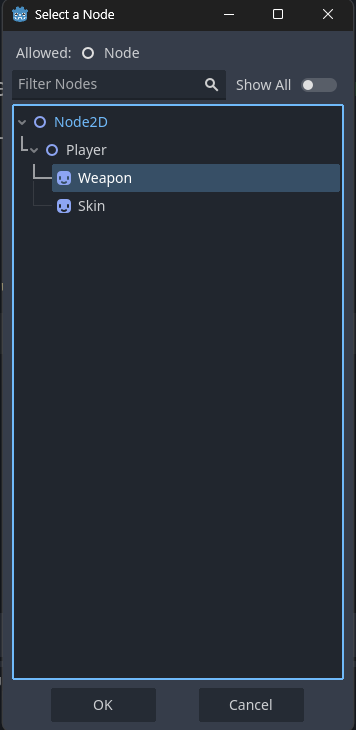

# *Godot Notes*

> [*Cheatsheet*](https://godot.community/topic/78/gdscript-cheatsheet/2)

### *Hello World*

```
extends Node2D

func _ready():
    print("Hello, World")
```

### *Modifying Label*



```
extends Node2D

func _ready() -> void:
	$Label.text = "Hello, Praphulla"
	$Label.modulate = Color.GREEN
```

### *Input*



```
extends Node2D

func _input(event) -> void:
	if event.is_action_pressed("my_action"):
		$Label.modulate = Color.RED
	if event.is_action_released("my_action"):
		$Label.modulate = Color.GREEN
```

### *Variable 1.0*

```
extends Node2D

var health: int = 100 # Integer Variable

func _ready() -> void:
	health = 120
	health += 30
	health -= 10
	health *= 90
	health /= 4
	print(health)
	
func _input(event: InputEvent) -> void:
	if event.is_action_pressed("my_action"):
		health -= 20
		print(health)
```

### *If Statements*

```
extends Node2D

var health: int = 20 # Integer Variable
	
func _input(event: InputEvent) -> void:
	if event.is_action_pressed("my_action"):
		health -= 1
		if (health <= 0):
			health = 0
			print("Health = ",health)
			print("You died")
		
		elif (health <= 10 and health % 2 == 0):
			print("Health is less than 10 and even")
		elif (health > 10 or health % 2 != 0):
			print("Health is over 10 or odd")
		else:
			print("Health = ",health)
```

### *Comments*

```
extends Node2D

func _ready() -> void:
	# This is a comment
	print("Comments")
	
```

### *Variables 2.0*




```
extends Node2D

@export var global_variable: int = 200 # Global variable 
const GRAVITY = -9.8 # Constant Variables

func _ready() -> void:
	# This is a comment
	var local_variable: int = 400
	
	# Data types
	var name: String = "Praphulla" # String variable
	var age: int = 18 # Integer Variable
	var height: float = 5.6 # Float variable
	var isStudent: bool = true # Bool Variable
	
	# Vectors
	var position_2d: Vector2 = Vector2(2.5, -4.5) # (x, y) -> float
	position_2d.x -= 2
	var position_3d: Vector3 = Vector3(10, -8, 12) # (x, y, z) -> float
	
	print(position_2d.x)
	print(position_2d)
	print(position_3d)

```

### *Functions*

```
extends Node2D

func fact(n: int) -> int:
	if n <= 1:
		return 1
	return n * fact(n - 1)

func jump() -> void:
	print("Jumped")

func _ready() -> void:
	var result: int = fact(5)
	print(result)

func _input(event: InputEvent) -> void:
	if event.is_action_pressed("my_action"):
		jump()

```

### *Random Numbers*

```
extends Node2D

func _ready() -> void:
	
	var roll: float = randf()
	
	if (roll <= 0.8):
		print("Common")
	else:
		print("Rare")
		
	var character_height = randi_range(120, 210)
	print("Your heigh is " + str(character_height) + "cm.")
	var percentage = randf_range(0, 100)
	print(percentage)
			
```

### *Arrays*

```
extends Node2D

func _ready() -> void:
	
	var items: Array[String] = ["Apple", "Banana", "Cherry"]
	print(items)
	
	print(items[0])
	items[1] = "Mango"
	
	items.remove_at(2)
	items.append("Grapes")
```

### *Loops*

```
extends Node2D

func _ready() -> void:
	
	var items: Array[String] = ["Apple", "Banana", "Cherry"]
	
	for item in items:
		if (item.length() > 5):
			print(item)
	
	for i in 10:
		print(i)
	
	var glass: float = 0.0
	
	while glass <= 10.0:
		print(glass)
		if glass > 3.4:
			break
		glass += 0.7
	print("The glass is full")
```

### *Dictionaries*

```
extends Node2D

func _ready() -> void:
	
	#var players: Dictionary = {
		#"Crook" : 10,
		 #"Villian" : 45,
		 #"Boss" : 110
	#}
	
	var players: Dictionary = {
		"Crook" : {"Level": 1, "Health": 100},
		"Villian" : {"Level": 78, "Health": 200},
		"Boss" : {"Level": 120, "Health": 400},
	}

	print(players["Villian"]["Level"])
	print(players["Villian"]["Health"])
	
	for username in players:
		print(username+ ": " + str(players[username]))

```

### *Enums*



```
extends Node2D

enum Alignment { ALLY, NEUTRAL, ENEMY}

@export var unit_alignment: Alignment

func _ready():
	if unit_alignment == Alignment.NEUTRAL:
		print("Neutral")
	elif unit_alignment == Alignment.ALLY:
		print("ALLY")
	else:
		print("Enemy")
```

### *Match*

```
extends Node2D

enum Alignment { ALLY, NEUTRAL, ENEMY}

@export var unit_alignment: Alignment

func _ready():
	match unit_alignment:
		Alignment.ALLY:
			print("Ally")
		Alignment.NEUTRAL:
			print("Neutral")
		Alignment.ENEMY:
			print("Enemy")
		_:
			print("Default")	
```

### *Modifying Nodes 2.0*







```
extends Node2D

@onready var weapon: Sprite2D = $Player/Weapon
@export var my_node: Node

func _ready():
	if my_node is Node2D:
		print("Node 2D")
```

### *Signals*

```
extends Node2D

var xp: int = 0

signal leveled_up(msg)

func _ready():
	leveled_up.connect(_on_leveled_up)

func _on_timer_timeout() -> void:
	xp += 5
	print(xp)
	if xp >= 20:
		xp = 0
		leveled_up.emit("Ding!")
		
func _on_leveled_up(msg) -> void:
	print(msg)

```

### *Get/Set*

```
extends Node2D

signal health_changed(new_health)

var health: int = 100:
	set(value):
		health = clamp(value, 0, 100)
		health_changed.emit(health)

var chance: float = 0.28
var chance_pet: int:
	get:
		return chance * 100
	set(value):
		chance = float(value) / 100.0

func _ready():
	health = 200
	print(chance_pet)
	chance_pet = 45
	print(chance_pet)
	
func _on_health_changed(new_health: Variant) -> void:
	print(new_health)
```

### *Classes*

#### *main.gd*

```
extends Node2D

@export var character_to_kill: Character

func _ready() -> void:	
	character_to_kill.die()

```

#### *character.gd*

```
class_name Character

extends Node

@export var profession: String
@export var health: int

func _ready() -> void:
	pass 

func die() -> void:
	health = 0
	print(profession + " died")

```

### *Inner Class*

#### *character.gd*

```
class_name Character

extends Node

var chest := Equipment.new()
var legs := Equipment.new()

class Equipment:
	var armor := 10
	var weight := 5

func _ready() -> void:
	chest.armor = 20
	print(chest.armor)
	legs.weight = 10
	print(legs.armor)
```